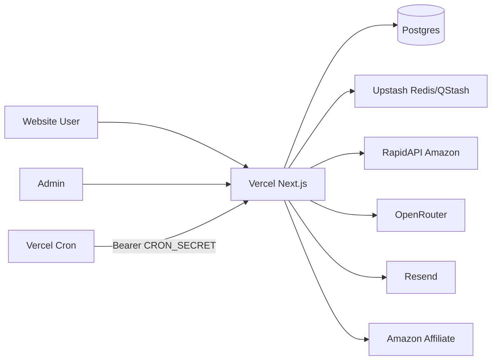

# Architektur-Übersicht IGZ

## Einleitung

Technische Übersicht der IGZ Amazon-Affiliate-Vergleichsplattform: Systemkontext, Komponenten, Datenflüsse, Deployment und Trust Boundaries.

## Geltungsbereich

Next.js-15-App auf Vercel, externes Postgres, Upstash (Redis/QStash/Workflow), RapidAPI, OpenRouter, Resend und Amazon-Redirects.

## Begriffe und Definitionen

| Begriff | Definition |
| --- | --- |
| Cache-first Page | Server Component liest nur DB |
| Entrypoint | Cron-Route mit kurzem Timeout |
| Trust Boundary | Grenze zwischen Vertrauenszonen |

## Verantwortlichkeiten

| Aktivität | Product Owner | Engineering | Security | Hosting |
| --- | --- | --- | --- | --- |
| Architekturentscheidungen | A | R | C | C |
| Runtime-/Quota-Grenzen | C | R | C | I |
| Diagramm pflegen | I | R | C | I |

## Detailbeschreibung

### Systemkontext

### Hauptkomponenten

| Komponente | Pfad | Aufgabe |
| --- | --- | --- |
| Public App | `src/app/[locale]/*` | SEO-Seiten, Tools |
| Admin | `src/app/admin/*`, `src/app/api/admin/*` | Moderation/Quota |
| Cron | `src/app/api/cron/*` | Enqueue + Auth |
| Workflows | `src/app/api/workflows/*` | Schwere Jobs |
| Amazon Sync | `src/lib/amazon/*` | Ingest + Quota |
| AI | `src/lib/ai/*` | Reviews/Chat |
| Security | `src/lib/security/*` | Cron/Redirect/RateLimit/IP |
| DB | `src/lib/db/*`, `prisma/schema.prisma` | Persistenz |

### Datenflüsse

1. Ingest: Cron → Workflow → RapidAPI → Product/Category Tabellen.
2. Content: Cron generate-* → OpenRouter → Article/Comments/Tech Profile.
3. Public Read: Page → Prisma (ohne Live-API).
4. Monetization: CTA → `/api/out` (Allowlist) → Amazon; optional `AffiliateClick`.
5. Interactive: Chat/Compare/Barcode mit Rate-Limit → externe APIs/DB.

### Schnittstellen

- REST Route Handlers unter `src/app/api/**`
- Vercel Cron Schedule in `vercel.json`
- Upstash Workflow HTTP Callbacks (`UPSTASH_WORKFLOW_URL`)

### Deployment-Modell

- Branch `master` → Vercel Production
- Build: `node scripts/prisma-db-push.mjs && next build --turbopack`
- Prisma generate in `postinstall`
- Serverless/Node; kein Custom Server; `/tmp` nur temporär

### Trust Boundaries

| Zone | Inhalt |
| --- | --- |
| Browser | Untrusted Input |
| Vercel Edge Middleware | i18n only |
| Vercel Node Functions | Trusted App Code + Secrets |
| Postgres | Data plane |
| Externe APIs | Semi-trusted; Keys in Env |

### Architekturentscheidungen

| ADR | Entscheidung | Status |
| --- | --- | --- |
| ADR-1 | Vercel-first, keine Docker-Prod-Server | aktiv |
| ADR-2 | Cache-first Public Pages | aktiv |
| ADR-3 | Cron enqueue + Workflow steps | aktiv |
| ADR-4 | Fail-closed Cron ohne Secret auf Vercel | aktiv (2026-07-20) |
| ADR-5 | Amazon-only Affiliate Redirects | aktiv (2026-07-20) |

## Nachweise und Artefakte

- `architektur.drawio`
- `vercel.json`, `package.json`, `README.md`
- Security-Module und Prisma-Schema

## Risiken und Kontrollen

| Risiko | Auswirkung | Eintrittswahrscheinlichkeit | Massnahme | Kontrolle | Nachweis |
| --- | --- | --- | --- | --- | --- |
| Cold Start / Timeout | Job-Abbruch | mittel | Workflow Steps + maxDuration | JobRun | workflows/* |
| QStash Budget | Jobs bleiben liegen | mittel | Wenige Produkte/Locales pro Run | Quota Docs | README |
| DB URL Misconfig | Build/Runtime Fail | mittel | URL-Resolver | Fehlertexte | `database-url.ts` |

## Pflegeprozess

Bei neuen externen Diensten oder Runtime-Wechseln Diagramm und ADR-Tabelle aktualisieren.

## Revisionshistorie

| Datum | Autor/Rolle | Änderung | Anlass |
| --- | --- | --- | --- |
| 2026-07-20 | Daily Evolution Agent / Architecture | Erstfassung + Security-ADRs | Daily Evolution |
